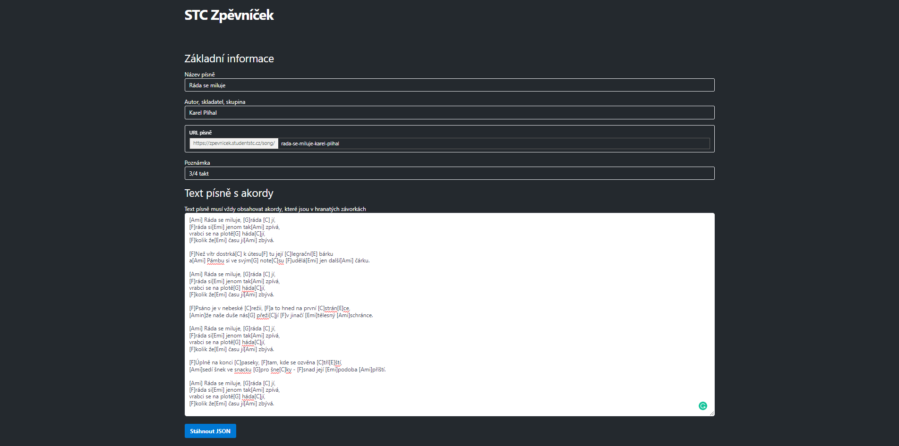
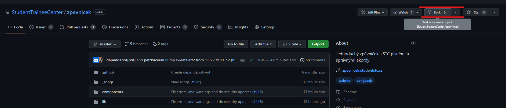
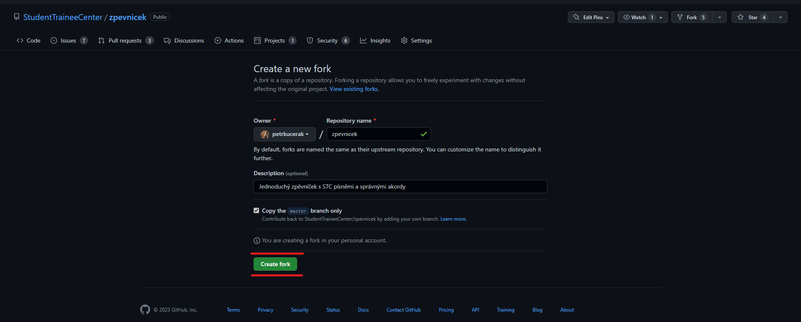
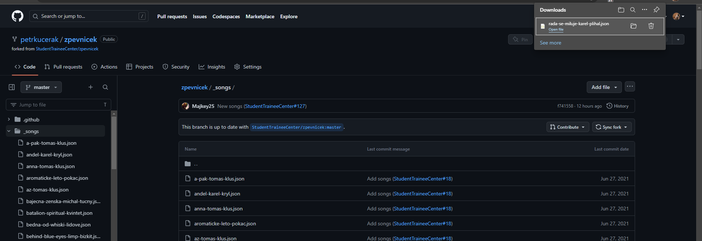
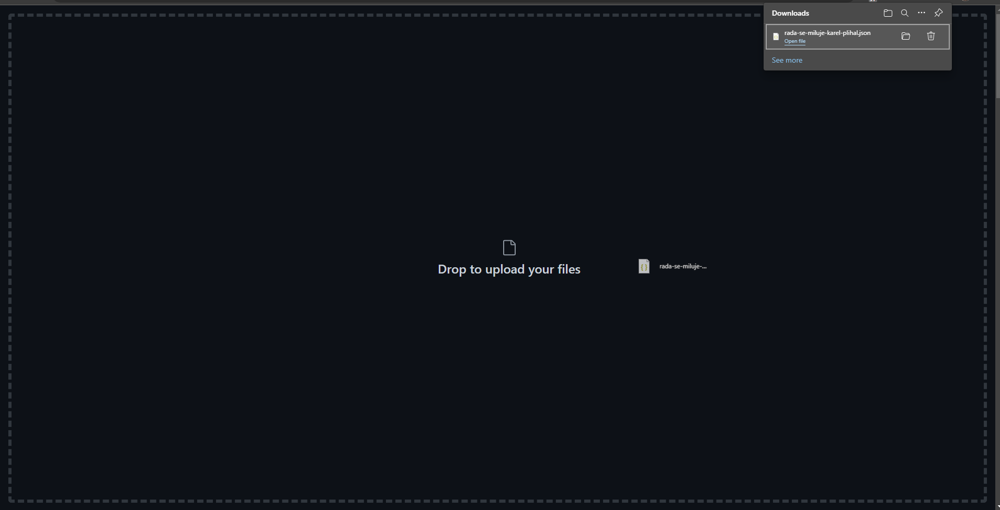
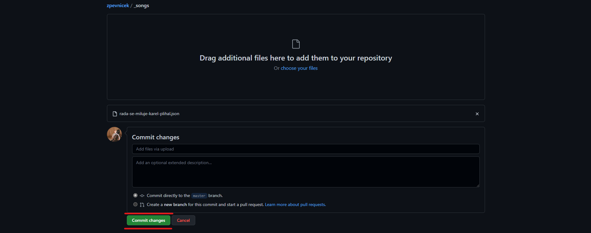
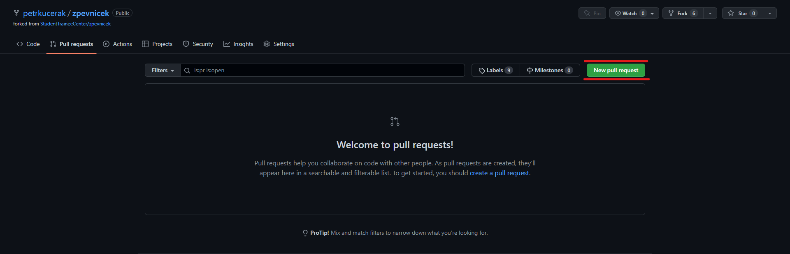
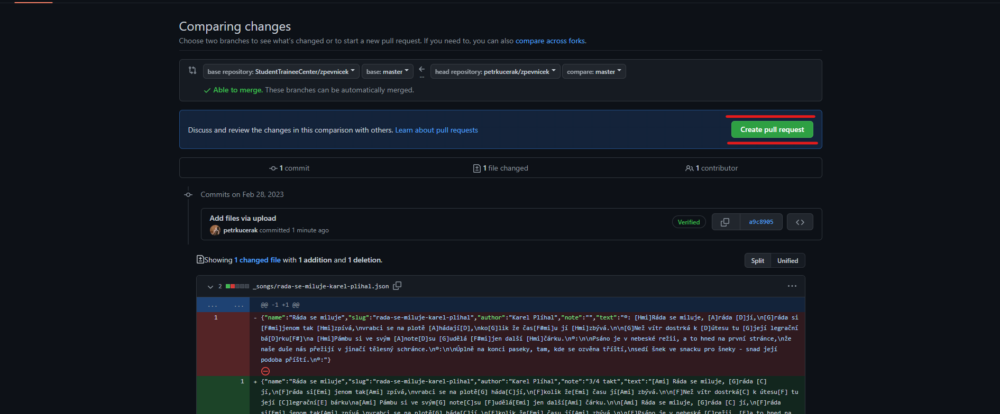
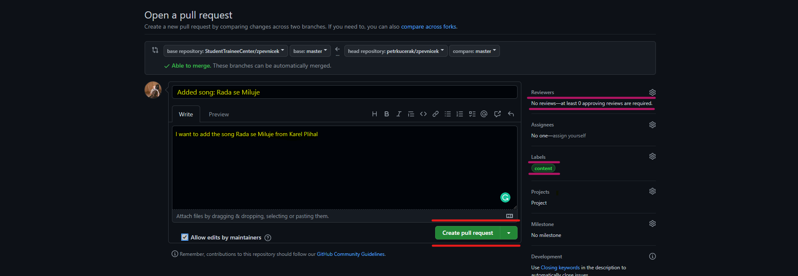

# Jak přidávat písně – detailní návod

## Příprava souboru

1. **Zkontrolujte si, že píseň není v zpěvníčku!**
2.	Přejděte na adresu formuláře: https://zpevnicek.studentstc.cz/form/

      - **Název písně**: pište s diakritikou a velkými písmeny
      - **Autor, skladatel, skupina**: pište s diakritikou a velkými písmeny
      - **URL písně**: vytváří se dynamicky z názvu písně a jména autora
      - **Poznámka**: můžete vepsat cokoliv vhodného (např. doporučeno hrát s Capo na 5 pražci)
      - **Text písně s akordy**
        - Text písně musí vždy obsahovat akordy, které jsou v hranatých závorkách.
        - Akordy musejí být po celou dobu písně i pokud se opakují.
        - Snažíme se zpěvníček tvořit celistvě a komplexne. Proto každá píseň musí být psaná celá, tj. ne např. text sloky a následně R jako refrén, ale je třeba zkopírovat celý text refrénu.
        - Pokud uděláte nový řádek, udělá se ový řádek i ve zpěvníčku.
        - Každý akord musí být napsaný v jedněch závorchá `[Ami][Emi]`. Syntaxe `[Ami, Emi]` je zakázaná z důvodu automatické transpozice tóniny.
        - Pole pro obsah lze zvětšit v pravém dolním rohu.
3. Před stažením si vše řádně zkontrolujte, připadně si celou píseň zahrajte, abyte ověřili, že nedošlo k chybě.
4.	Stáhněte soubor JSON obsahující píseň.

## Nahrání souboru

*Je v plánu tuto část automatizovat viz: https://github.com/StudentTraineeCenter/zpevnicek/issues/118. V případě zájmu pomoci, dejte vědět.*

***UPOZORNĚNÍ**: Postup, který je zde popisován je přizpůsoben, aby ho dokázal využít i člověk, který neumí pracovat s gitem.*

5. Forkněte si repozotář k sobě.

6. Otevřete složku `_songs` a nahrajte do ní stažený soubor. Nahrání lze realizovat pouhým přetažením souboru.

7. Nahrání potvrďte commitnutím a doplněním případného názvu změny či popisu změny.

8. Po nahrání je třeba vytvořit žádost o přidání vaší písně do oficiální repozitáře STC. To uděláte pomocí tzv. pull requestu. Pull request musí obsahovat:
   - jasný název v angličtině
   - popis, jaké písně přidáváte
   - label: content
   - k *Reviewer* přiřazeného uživatele `petrkucerak` - pokud tento krok neučinítě, nemusíme si všimnout žádosti o přidání nové písně

9. Nyní již stačí počkat na schválení a píseň se automaticky nahraje.